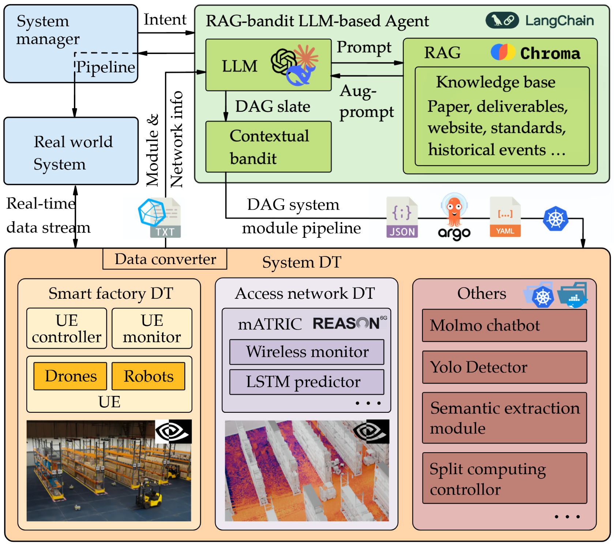

# Future Factories with 6G: Agentic AI and Cyber-Physical Digital Twins

[](https://www.python.org/)
[](https://kubernetes.io/)
[](https://argoproj.github.io/argo-workflows/)
[](https://helm.sh/)
[](https://www.docker.com/)
[](LICENSE)

Agentic AI DT is a Python platform for agentic AI–driven xApp orchestration. It combines bandit-based decisioning with RAG pipelines and evaluation loops to deploy and manage workflows on Kubernetes (via Argo Workflows), enabling reproducible, data‑driven orchestration for digital twins and network functions.



## Features
- Agentic orchestration of xApps using bandit strategies
- Retrieval-Augmented Generation (RAG) pipeline for contextual decisions
- Pluggable evaluation and feedback loops
- Kubernetes-native execution via Argo Workflows and Helm
- Metrics logging to JSONL for analysis and audit
- Local and cluster execution modes

## Repository Structure
```
agentic-ai-dt/
├── main.py                 # Pipeline entrypoint
├── config.py               # Configuration settings
├── requirements.txt        # Python dependencies
├── helpers/                # Core modules (bandit, rag_chain, evaluation, etc.)
├── db/                     # Local DB files (e.g., ChromaDB)
├── materials/              # Source docs and deliverables
├── pipeline_blacklist.json # Pipeline filtering
├── run_metrics.jsonl       # Metrics output
├── README.md               # Project documentation
└── docs/
    └── architecture.png    # System diagram
```

## Quick Start

- Python only (local):
```bash
python3 -m venv .venv
source .venv/bin/activate
pip install -r requirements.txt

# Run the pipeline locally
python main.py
```

- Kubernetes with Argo (Linux):
```bash
# k3s (or use an existing K8s cluster)
curl -sfL https://get.k3s.io | sh -
kubectl get nodes

# Helm + Argo Workflows
helm repo add argo https://argoproj.github.io/argo-helm
helm repo update
helm install argo argo/argo-workflows --namespace argo --create-namespace

# (Optional) Expose Argo UI
kubectl -n argo port-forward deploy/argo-workflows-server 2746:2746
# Visit http://localhost:2746

# Minimal RBAC to allow Argo service account to manage workflows in default ns
cat <<'EOF' > argo-permissions.yaml
apiVersion: rbac.authorization.k8s.io/v1
kind: Role
metadata:
  name: argo-workflow-role
  namespace: default
rules:
- apiGroups: ["argoproj.io"]
  resources: ["workflows", "workflowtemplates", "cronworkflows"]
  verbs: ["create", "get", "list", "watch", "update", "patch", "delete"]
- apiGroups: [""]
  resources: ["pods", "pods/exec", "services", "configmaps", "secrets"]
  verbs: ["create", "get", "list", "watch", "update", "patch", "delete"]
---
apiVersion: rbac.authorization.k8s.io/v1
kind: RoleBinding
metadata:
  name: argo-workflow-binding
  namespace: default
roleRef:
  apiGroup: rbac.authorization.k8s.io
  kind: Role
  name: argo-workflow-role
subjects:
- kind: ServiceAccount
  name: default
  namespace: argo
EOF
kubectl apply -f argo-permissions.yaml

# (Optional) Pull private images from GHCR
kubectl create secret docker-registry ghcr-creds \
  --docker-server=https://ghcr.io \
  --docker-username=$YOUR_GITHUB_USERNAME \
  --docker-password=$YOUR_GITHUB_TOKEN \
  --docker-email=$YOUR_EMAIL
```

Then:
```bash
# Run the Python entrypoint that submits/controls workflows as configured
python main.py
```

## Configuration
- config.py: Core runtime and provider settings.
- pipeline_blacklist.json: Excludes pipeline steps or resources at runtime.
- Environment variables: Set provider credentials (e.g., LLM keys) or registry auth as needed:
```bash
export OPENAI_API_KEY=...
export HF_TOKEN=...
export ARGO_SERVER="https://argo-workflows.argo.svc:2746" # if using external access
```

## Usage
- Edit materials/ to add your source documents for RAG.
- Update helpers/ modules (bandit, rag_chain, evaluation) to tailor orchestration logic.
- Metrics are appended to run_metrics.jsonl for analysis.
- Switch between local and cluster modes via config.py and environment variables.

## Development
```bash
# Setup
python3 -m venv .venv && source .venv/bin/activate
pip install -r requirements.txt

# Lint/format/tests (adjust to your toolchain)
pip install black flake8 pytest
black .
flake8
pytest -q
```

## Troubleshooting
- Argo UI not accessible: ensure port-forward is active and the server deployment is running.
- Workflow stuck/pending: check service account permissions and image pull secrets.
- Missing provider keys: verify required env vars in your shell and in the Argo workflow template.

## Contributing
Contributions are welcome. Please open an issue to discuss changes before submitting a PR. Ensure code is formatted and tests pass.

## License
MIT © Contributors
